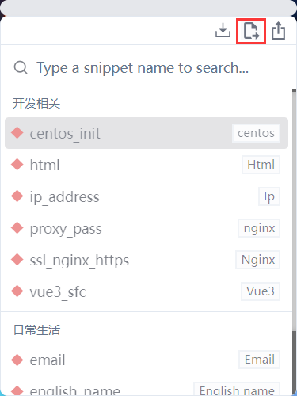

## code-snippet
面向开发人员，为了实现创建、组织和共享代码片段的功能，并且不依赖于用户自己使用的IDE
>目前只支持windows
## 使用
1. 点击快捷键去往文件夹

      
2. 在文件夹里面创建文件（文件夹），其中文件命名格式为[name].[type].rss。（文件名必须为以上格式，因为此程序会根据文件名对文件进行分类和命名显示）  
3. 使用app进行搜索，↑、↓键可以控制选择，按住enter键会将文件内容复制在鼠标聚焦位置（支持vim模式）

## 演示
